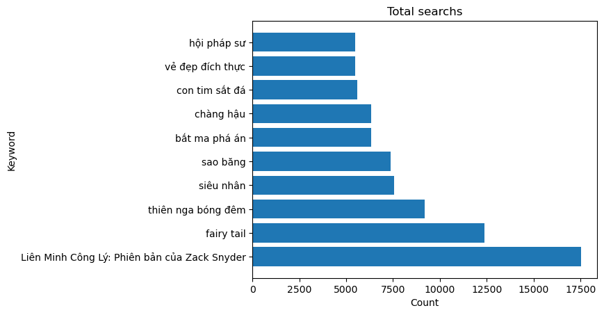

# ANALYSIS OF USERS' SEARCH TRENDS FROM JUNE TO JULY 2022

## Number of searches in both June and July

- The anime genre is a prominent genre in search during June and July, followed by the romantic comedy genre.
=> In both June and July, users were interested in entertaining and funny content combined with romance. Additionally, the anime element also received significant attention.
## The top 10 most searched categories

|Rank  |Most_Watch_T6                               |Most_Watch_T7                               |
|------|--------------------------------------------|--------------------------------------------|
|1     |Liên Minh Công Lý: Phiên bản của Zack Snyder|Liên Minh Công Lý: Phiên bản của Zack Snyder|
|2     |siêu nhân                                   |siêu nhân                                   |
|3     |trữ tình                                    |trữ tình                                    |
|4     |bolero                                      |bolero                                      |
|5     |fairy tail                                  |fairy tail                                  |
|6     |thiếu nhi                                   |thiếu nhi                                   |
|7     |tôi thấy hoa vàng trên cỏ xanh              |tôi thấy hoa vàng trên cỏ xanh              |
|8     |Tìm kiếm bằng giọng nói                     |Tìm kiếm bằng giọng nói                     |
|9     |thế giới động vật                           |thế giới động vật                           |
|10    |prime provider                              |prime provider                              |

- Anime and romantic comedy films continue to be the two most popular genres that users search for. 
=> During the period from June 2022 to July 2022, users maintained a consistent trend of searching for content related to romance, comedy, and anime.

## The shifting trend of searched genres from June to July

|Rank  |Month 6                                     |Month 7                       |
|------|--------------------------------------------|------------------------------|
|1     |siêu nhân                                   |tôi thấy hoa vàng trên cỏ xanh|
|2     |tôi thấy hoa vàng trên cỏ xanh              |siêu nhân                     |
|3     |thiên nga bóng đêm                          |anna                          |
|4     |tôi thấy hoa vàng trên cỏ xanh              |taxi, em tên gì?              |
|5     |mộng hoa lục                                |anna                          |
|6     |Liên Minh Công Lý: Phiên bản của Zack Snyder|Kẻ Trộm Mặt Trăng: Minions    |
|7     |fairy tail                                  |hội pháp sư                   |
|8     |bolero                                      |trữ tình                      |
|9     |tôi thấy hoa vàng trên cỏ xanh              |tấm cám: chuyện chưa kể       |
|10    |nữ thanh tra tài ba                         |anna                          |

- The romantic comedy genre and anime demonstrate a close relationship as there is a significant crossover in search interest between the two. The audience's interest often shifts back and forth between these two genres, indicating a strong connection between them.

## Summary

- Romantic comedy combined with Anime is the most popular genre in June and July.
- During the months of June and July, users did not show significant changes in their search preferences. If there were any changes, it was mainly a shift back and forth between the two popular genres, anime and romantic comedy.
=> Utilize the still hot keywords of "Emotions," "Humor," and "Anime" to generate suitable ideas for promotional purposes.